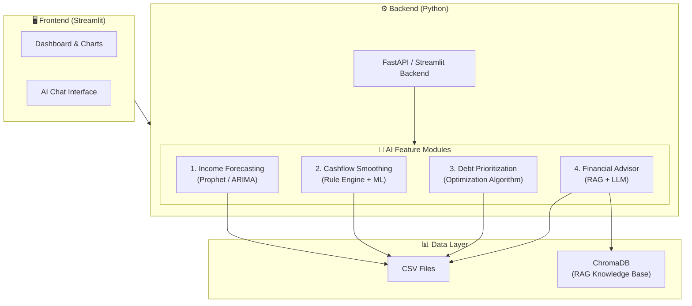

# WellFinanced — AI Financial Advisor for Freelancers

## Hackathon Implementation Plan

---

## Problem Statement

Freelancers and independent workers face **unstable income** and **irregular cash flow**, making it difficult to manage expenses, debts, and personal financial goals. WellFinanced solves this by providing an AI-powered personal financial assistant that:

- Predicts future income using historical patterns
- Smooths cash flow by allocating a "virtual salary"
- Prioritizes debt payments intelligently
- Provides a conversational AI advisor for purchase and financial decisions

---

## Available Data (Schema Overview)

We have **5 datasets** covering 120 Egyptian freelancers across ~2 years (Jun 2022 – Apr 2024):

| Dataset | Records | Key Columns |
|---------|---------|-------------|
| `users.csv` | 120 | `user_id`, `name`, `job_category`, `profile_type` (stable/growing/inconsistent/struggling), `avg_monthly_income`, `city` |
| `income.csv` | ~4,400 | `user_id`, `amount`, `platform` (Upwork, Mostaql, Khamsat...), `category`, `received_at`, `month` |
| `expenses.csv` | ~27,300 | `user_id`, `category` (Rent, Food, Medical...), `amount`, `is_recurring`, `expense_date` |
| `debts.csv` | ~157 | `user_id`, `debt_name`, `total_amount`, `remaining_amount`, `interest_rate`, `monthly_payment`, `due_date`, `priority` |
| `savings_goals.csv` | ~130 | `user_id`, `goal_name`, `target_amount`, `saved_amount`, `monthly_contribution`, `deadline` |

---

## Architecture Overview



---

## Tech Stack

| Layer | Technology | Rationale |
|-------|-----------|-----------|
| **Frontend** | Streamlit | Rapid prototyping, built-in charts, hackathon-friendly |
| **Backend** | Python | All ML/AI libraries ecosystem |
| **Income Forecasting** | Prophet + statsmodels | Best for time series with seasonality on small data |
| **Cashflow Smoothing** | Pandas + custom rules | Moving averages, percentile-based salary allocation |
| **Debt Prioritization** | Custom algorithm (Avalanche/Snowball hybrid) | Classic financial optimization |
| **RAG Advisor** | LangChain + ChromaDB + Gemini API | Contextual financial advice |
| **Visualization** | Plotly + Streamlit charts | Interactive, beautiful dashboards |

---

## Feature Details

### Feature 1: Predictive Income Forecasting 📈

**Goal**: Predict the user's income for the next 3-6 months.

**Approach**:
1. **Data Preparation**: Aggregate monthly income per user from `income.csv`
2. **Model**: Facebook Prophet (handles seasonality, missing months, outliers)
   - Fallback: Simple Exponential Smoothing for users with < 12 months of data
3. **Features**:
   - Monthly income trend
   - Platform diversification score
   - Category stability index
4. **Output**:
   - Predicted monthly income (next 3-6 months)
   - Confidence intervals (optimistic / pessimistic)
   - Income stability score (0-100)

**Pipeline**:
```
income.csv → Aggregate by month → Fill missing months → Prophet model → Forecast
```

#### Key Files:
- `features/income_forecast.py` — Model training & prediction
- `utils/data_loader.py` — Data preprocessing

---

### Feature 2: Intelligent Cashflow Smoothing 💰

**Goal**: Allocate a "virtual fixed salary" from irregular income, manage savings buffer.

**Approach**:
1. **Calculate recommended salary**: Based on predicted income (conservative estimate)
   - Formula: `virtual_salary = predicted_monthly_income × 0.7` (70% rule)
   - Adjusted by `profile_type`: stable → 0.8, growing → 0.75, inconsistent → 0.65, struggling → 0.6
2. **Expense Analysis**:
   - Separate recurring vs. non-recurring expenses
   - Calculate average monthly expenses by category
   - Identify expense trends
3. **Budget Allocation**:
   - **Needs** (50%): Rent, Utilities, Food, Transport
   - **Wants** (30%): Entertainment, Clothes, Subscriptions
   - **Savings** (20%): Emergency fund, goals
4. **Monthly Plan Output**:
   - Recommended salary amount
   - Budget breakdown by category
   - Surplus/deficit alert
   - Savings goal progress tracking

#### Key Files:
- `features/cashflow_smoothing.py` — Salary calculation & budget allocation
- `features/expense_analyzer.py` — Expense categorization & trends

---

### Feature 3: Autonomous Debt & Bill Prioritization 🎯

**Goal**: Optimize which debts to pay first, considering interest rates, due dates, and cash available.

**Approach**:
1. **Debt Scoring Algorithm**:
   ```
   urgency_score = w1 × interest_rate_normalized + 
                   w2 × (1 / days_until_due) + 
                   w3 × (remaining_amount / total_amount) +
                   w4 × priority_from_data
   ```
   - Weights: w1=0.35, w2=0.30, w3=0.15, w4=0.20
2. **Strategy Selection**:
   - **Avalanche** (default): Highest interest rate first → saves money
   - **Snowball**: Smallest balance first → psychological wins
   - **Hybrid** (recommended): Urgent debts first, then avalanche
3. **Payment Plan Generation**:
   - Distribute available money across debts
   - Calculate payoff timeline
   - Show total interest saved vs. minimum payments
4. **Bill Calendar**:
   - Upcoming due dates
   - Auto-prioritized payment schedule

#### Key Files:
- `features/debt_prioritizer.py` — Scoring & optimization
- `features/payment_planner.py` — Payment schedule generation

---

### Feature 4: Behavioral Financial Advisor (RAG-based) 🤖

**Goal**: An LLM chatbot that gives personalized financial advice based on user data.

**Approach**:
1. **Knowledge Base (RAG)**:
   - Financial literacy articles (budgeting, saving, debt management)
   - Egyptian freelancer-specific advice
   - Common financial rules (50/30/20, emergency fund = 3-6 months expenses)
   - Stored in ChromaDB vector database
2. **User Context Injection**:
   - Current financial snapshot (income, expenses, debts, savings)
   - Income forecast results
   - Debt priority results
3. **Use Cases**:
   - "Can I afford to buy a new laptop this month?"
   - "Should I take this installment plan?"
   - "How do I build an emergency fund?"
   - "Which debt should I pay first?"
4. **LLM**: Google Gemini API
   - System prompt with financial advisor persona
   - RAG retrieval for relevant knowledge
   - User data context for personalized advice

#### Key Files:
- `features/financial_advisor.py` — RAG pipeline & chat logic
- `knowledge/` — Financial knowledge base documents
- `utils/rag_engine.py` — ChromaDB setup & retrieval

---

## Project Structure

```
Wellfinanced/
├── app.py                          # Main Streamlit app
├── requirements.txt                # Dependencies
├── .env                            # API keys (Gemini)
│
├── data/                           # Dataset files
│   ├── users.csv
│   ├── income.csv
│   ├── expenses.csv
│   ├── debts.csv
│   └── savings_goals.csv
│
├── features/                       # AI Feature modules
│   ├── __init__.py
│   ├── income_forecast.py          # Feature 1: Time series prediction
│   ├── cashflow_smoothing.py       # Feature 2: Virtual salary & budgeting
│   ├── expense_analyzer.py         # Feature 2 helper: Expense analysis
│   ├── debt_prioritizer.py         # Feature 3: Debt scoring & prioritization
│   ├── payment_planner.py          # Feature 3 helper: Payment schedules
│   └── financial_advisor.py        # Feature 4: RAG chatbot
│
├── utils/                          # Shared utilities
│   ├── __init__.py
│   ├── data_loader.py              # CSV loading & preprocessing
│   ├── rag_engine.py               # ChromaDB & embedding utilities
│   └── prompts.py                  # LLM prompt templates
│
├── knowledge/                      # RAG knowledge base
│   ├── budgeting_basics.md
│   ├── debt_management.md
│   ├── freelancer_finance_tips.md
│   └── egyptian_financial_guide.md
│
└── assets/                         # UI assets
    └── logo.png
```

---

## Frontend Design (Streamlit)

### Page Layout

#### 1. Dashboard (Home)
- **User selector** (dropdown to pick a freelancer)
- **Financial Health Score** (0-100, color-coded gauge)
- **Quick Stats Cards**: Total Income, Total Expenses, Net Balance, Active Debts
- **Income vs Expenses Chart** (monthly bar chart)
- **Savings Goals Progress** (progress bars)

#### 2. Income Forecast Page
- **Historical Income Chart** (line chart with actual data)
- **Forecast Overlay** (predicted line with confidence band)
- **Income Breakdown by Platform** (pie chart)
- **Stability Score** & trend indicator

#### 3. Budget & Cashflow Page
- **Virtual Salary Recommendation** (big number card)
- **Budget Allocation** (50/30/20 donut chart)
- **Expense Breakdown** (bar chart by category)
- **Monthly Comparison** (expenses vs. recommended budget)

#### 4. Debt Management Page
- **Debt Overview Table** (sorted by priority score)
- **Payment Strategy Comparison** (Avalanche vs Snowball vs Hybrid)
- **Payoff Timeline** (Gantt-style chart)
- **Total Interest Saved** metric

#### 5. AI Advisor (Chat)
- **Chat Interface** with conversation history
- **Quick Action Buttons**: "Can I afford...?", "Savings advice", "Debt strategy"
- **Context Panel** (sidebar showing user's financial summary)

---

## Execution Timeline (Hackathon Sprint)

> [!IMPORTANT]
> This is structured as a hackathon sprint. Estimated total: **8-12 hours** of focused work.

### Phase 1: Foundation (2 hours)
- [x] Data exploration & understanding ✅
- [ ] Project setup (structure, requirements, env)
- [ ] `data_loader.py` — CSV loading & preprocessing utilities
- [ ] Basic Streamlit app shell with navigation

### Phase 2: Core Features (4-5 hours)
- [ ] **Feature 1**: Income Forecasting (1.5 hrs)
  - Prophet model training
  - Forecast API
  - Visualization
- [ ] **Feature 2**: Cashflow Smoothing (1 hr)
  - Virtual salary calculation
  - Budget allocation engine
  - Expense analysis
- [ ] **Feature 3**: Debt Prioritization (1 hr)
  - Scoring algorithm
  - Payment plan generation
  - Strategy comparison
- [ ] **Feature 4**: AI Advisor (1.5 hrs)
  - Knowledge base creation
  - RAG setup with ChromaDB
  - Chat interface with Gemini

### Phase 3: Frontend & Polish (2-3 hours)
- [ ] Dashboard with all visualizations
- [ ] Interactive charts (Plotly)
- [ ] Chat UI refinement
- [ ] UI/UX polish & responsive design

### Phase 4: Testing & Demo (1-2 hours)
- [ ] End-to-end testing with different user profiles
- [ ] Demo preparation (screenshots, recording)
- [ ] README documentation

---

## User Review Required

> [!IMPORTANT]
> **LLM API Choice**: The plan uses **Google Gemini API** for the RAG advisor. Do you have an API key ready, or do you prefer an alternative (OpenAI, local model, etc.)?

> [!IMPORTANT]
> **Frontend Framework**: Streamlit is proposed for hackathon speed. Would you prefer a different approach (e.g., a full web app with Flask + React)?

> [!WARNING]
> **Deployment**: For hackathon demo, we can deploy to **Streamlit Cloud** (free) or **Hugging Face Spaces**. Which do you prefer?

---

## Open Questions

1. **اسم التطبيق**: هل "WellFinanced" هو الاسم النهائي ولا عندك اسم تاني؟
2. **اللغة**: الواجهة هتكون بالإنجليزي ولا بالعربي؟
3. **الهاكاثون**: إيه الـ time constraint بالظبط؟ يوم؟ يومين؟ أسبوع؟
4. **الـ Demo**: عاوزة تقدمي على user واحد ولا على كذا user؟
5. **الـ Chatbot**: عاوزة يتكلم عربي ولا إنجليزي؟ ولا الاتنين؟
6. **Platform**: هل الأفضل نشتغل Jupyter Notebooks للتحليل والموديلز أول، وبعدين نعمل الـ app؟ ولا نبني الـ app مباشرة؟

---

## Verification Plan

### Automated Tests
- Test income forecast accuracy on held-out months (last 3 months as test set)
- Verify debt prioritization scoring produces correct ordering
- Test cashflow allocation sums to 100%
- Validate RAG retrieval returns relevant financial knowledge

### Manual Verification
- Walk through the full flow for 3 user profiles: `stable`, `struggling`, `inconsistent`
- Test chatbot with realistic questions
- Verify all charts render correctly
- Cross-check budget recommendations against actual data

### Demo Scenarios
1. **User `user_0001`** (growing profile, 3 debts) — Full feature showcase
2. **User `user_0009`** (struggling, 2 debts) — Show how the app helps struggling freelancers
3. **User `user_0005`** (stable, high income, 2 debts) — Show optimization opportunities
