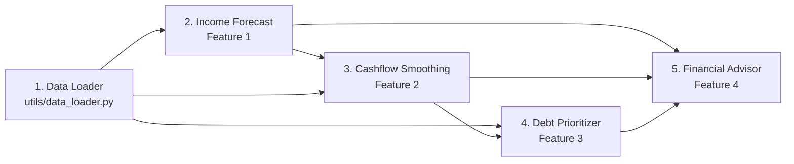

# WellFinanced — AI Features Implementation Plan

> **Scope**: AI/ML components only. Backend & Frontend handled by other team members.

---

## Data Overview

| Dataset | Records | Key Columns |
|---------|---------|-------------|
| `users.csv` | 120 | `user_id`, `profile_type` (stable/growing/inconsistent/struggling), `avg_monthly_income` |
| `income.csv` | ~4,400 | `user_id`, `amount`, `platform`, `category`, `month` |
| `expenses.csv` | ~27,300 | `user_id`, `category`, `amount`, `is_recurring`, `expense_date` |
| `debts.csv` | ~157 | `user_id`, `debt_name`, `remaining_amount`, `interest_rate`, `monthly_payment`, `due_date`, `priority` |
| `savings_goals.csv` | ~130 | `user_id`, `goal_name`, `target_amount`, `saved_amount`, `monthly_contribution`, `deadline` |

---

## Feature 1: Predictive Income Forecasting 📈

### Goal
Predict freelancer's income for next **3-6 months** using historical data.

### Approach

**Step 1 — Data Prep:**
```
income.csv → GROUP BY (user_id, month) → SUM(amount) → monthly_income time series per user
```
- Fill missing months with 0
- Handle outliers (cap at 3× median)
- Minimum 6 months history required

**Step 2 — Model: Facebook Prophet**
- Why Prophet: handles seasonality, missing data, outliers automatically
- Fallback for users with < 8 months: **Simple Exponential Smoothing** (statsmodels)

**Step 3 — Extra Features (Regressors):**
- `num_platforms`: عدد المنصات اللى بيشتغل عليها الشهر ده
- `num_projects`: عدد المشاريع في الشهر
- `platform_diversity`: Shannon entropy للمنصات

**Step 4 — Output:**
- `predicted_income`: المتوسط المتوقع
- `lower_bound`, `upper_bound`: Confidence interval (80%)
- `stability_score`: (0-100) based on coefficient of variation

### Evaluation
- Train on first 80% of months, test on last 20%
- Metrics: **MAE**, **MAPE**, **RMSE**

### Key File: `features/income_forecast.py`

---

## Feature 2: Intelligent Cashflow Smoothing 💰

### Goal
Convert irregular income into a **virtual fixed salary** + smart budget allocation.

### Approach

**Step 1 — Virtual Salary Calculation:**
```python
base = predicted_monthly_income  # from Feature 1
multiplier = {"stable": 0.80, "growing": 0.75, "inconsistent": 0.65, "struggling": 0.60}
virtual_salary = base * multiplier[profile_type]
```

**Step 2 — Expense Analysis:**
```
expenses.csv → GROUP BY (user_id, month, category) → SUM(amount)
```
- Separate **recurring** (Rent, Internet, Phone, Electricity) vs **non-recurring**
- Calculate monthly averages per category
- Detect spending trends (increasing/decreasing)

**Step 3 — Budget Allocation (50/30/20 Rule):**

| Category | % | Items |
|----------|---|-------|
| **Needs** | 50% | Rent, Electricity, Internet, Phone, Food, Transport, Medical |
| **Wants** | 30% | Entertainment, Clothes, Subscriptions, Education, Other |
| **Savings** | 20% | Emergency fund, savings goals |

**Step 4 — Output:**
- `virtual_salary`: الراتب الثابت المقترح
- `budget_breakdown`: توزيع الميزانية بالأرقام
- `surplus_deficit`: الفرق بين الدخل والمصروفات
- `savings_recommendation`: المبلغ اللى المفروض يوفره
- `spending_alerts`: تحذيرات لو فيه category بتزيد عن اللازم

### Key Files: `features/cashflow_smoothing.py`, `features/expense_analyzer.py`

---

## Feature 3: Autonomous Debt & Bill Prioritization 🎯

### Goal
Rank debts by urgency and generate optimal payment plan.

### Approach

**Step 1 — Debt Scoring:**
```python
urgency_score = (
    0.35 * normalize(interest_rate) +        # الفايدة الأعلى أخطر
    0.30 * normalize(1 / days_until_due) +    # الأقرب في الميعاد أهم
    0.15 * normalize(remaining / total) +     # نسبة المتبقي
    0.20 * normalize(1 / priority)            # أولوية المستخدم
)
```
- All values normalized to [0, 1] using Min-Max scaling

**Step 2 — Strategy Comparison:**

| Strategy | Logic | Best For |
|----------|-------|----------|
| **Avalanche** | Pay highest interest first | Saving money long-term |
| **Snowball** | Pay smallest balance first | Psychological motivation |
| **Hybrid** ⭐ | Urgent debts first → then Avalanche | Balanced approach |

**Step 3 — Payment Plan Generator:**
- Input: available monthly budget for debts (from Feature 2's allocation)
- Output: month-by-month payment schedule per debt
- Calculate: `total_interest_paid`, `months_to_debt_free`, `money_saved_vs_minimum`

**Step 4 — Output:**
- `ranked_debts`: ترتيب الديون حسب الأولوية
- `payment_schedule`: جدول السداد الشهري
- `payoff_date`: تاريخ الخلاص من كل دين
- `strategy_comparison`: مقارنة بين الـ 3 strategies

### Key Files: `features/debt_prioritizer.py`, `features/payment_planner.py`

---

## Feature 4: Behavioral Financial Advisor (RAG + LLM) 🤖

### Goal
Chatbot يرد على أسئلة مالية بناءً على بيانات المستخدم الفعلية.

### Approach

**Step 1 — Knowledge Base:**
- Create markdown documents with financial advice topics:
  - Budgeting basics, debt management, emergency funds
  - Freelancer-specific tips (irregular income handling)
  - Egyptian context (installments, savings certificates)
- Embed using sentence-transformers → store in **ChromaDB**

**Step 2 — User Context Builder:**
```python
def build_context(user_id):
    return {
        "income_summary": get_income_stats(user_id),
        "expense_summary": get_expense_stats(user_id),
        "debt_summary": get_debt_info(user_id),
        "savings_summary": get_savings_info(user_id),
        "forecast": get_income_forecast(user_id),
        "budget": get_budget_allocation(user_id),
    }
```

**Step 3 — RAG Pipeline:**
```
User Question → Embed → ChromaDB similarity search → Top 3 docs
→ Combine (knowledge + user_context + question)
→ Gemini API → Response
```

**Step 4 — Example Use Cases:**
- "أقدر أشتري لابتوب جديد الشهر ده؟" → يحسب لو فيه surplus كافي
- "أدفع أنهي دين الأول؟" → يستخدم نتايج Feature 3
- "إزاي أوفر لشقة؟" → يعمل خطة توفير بناءً على الدخل والمصاريف
- "لو عاوز أقسط موبايل بـ 500 جنيه شهرياً، ينفع؟" → يحسب التأثير على الميزانية

**Step 5 — System Prompt:**
```
You are WellFinanced AI — a personal financial advisor for freelancers in Egypt.
You have access to the user's real financial data. Give specific, actionable advice.
Always reference actual numbers. Be encouraging but realistic.
Respond in the same language the user uses (Arabic or English).
```

### Key Files: `features/financial_advisor.py`, `utils/rag_engine.py`, `knowledge/*.md`

---

## Project Structure (AI Part Only)

```
features/
├── __init__.py
├── income_forecast.py       # Feature 1
├── cashflow_smoothing.py    # Feature 2
├── expense_analyzer.py      # Feature 2 helper
├── debt_prioritizer.py      # Feature 3
├── payment_planner.py       # Feature 3 helper
└── financial_advisor.py     # Feature 4

utils/
├── __init__.py
├── data_loader.py           # CSV loading & preprocessing
├── rag_engine.py            # ChromaDB + embeddings
└── prompts.py               # LLM system prompts

knowledge/
├── budgeting_basics.md
├── debt_management.md
├── freelancer_tips.md
└── egyptian_finance.md
```

---

## Dependencies

```
pandas
numpy
prophet
statsmodels
scikit-learn
langchain
chromadb
google-generativeai
sentence-transformers
```

---

## Execution Order

> [!IMPORTANT]
> الترتيب مهم عشان كل feature بتعتمد على اللى قبلها.



1. **Data Loader** — أول حاجة: تحميل وتنظيف البيانات
2. **Income Forecast** — لازم يشتغل الأول عشان Feature 2 محتاجاه
3. **Cashflow Smoothing** — محتاج نتايج الـ forecast
4. **Debt Prioritizer** — محتاج الـ budget من Feature 2
5. **Financial Advisor** — محتاج كل النتايج من الـ 3 features التانيين

---

## API Interface (للتسليم للـ Backend Team)

كل feature هتعمل expose لـ functions واضحة:

```python
# Feature 1
def forecast_income(user_id: str, months_ahead: int = 3) -> dict
# Returns: {predicted_income, lower_bound, upper_bound, stability_score}

# Feature 2  
def get_budget_plan(user_id: str) -> dict
# Returns: {virtual_salary, budget_breakdown, surplus_deficit, alerts}

# Feature 3
def prioritize_debts(user_id: str, strategy: str = "hybrid") -> dict
# Returns: {ranked_debts, payment_schedule, payoff_timeline, interest_saved}

# Feature 4
def chat(user_id: str, message: str, history: list = []) -> str
# Returns: AI response string
```

---

## Open Questions

1. **Gemini API Key**: عندك key جاهز؟
2. **اللغة**: الـ chatbot يتكلم عربي ولا إنجليزي ولا الاتنين؟
3. **هل نبدأ بـ notebooks للتجربة الأول وبعدين نحول لـ modules؟**
4. **مدة الهاكاثون**: عشان أحدد أولويات لو الوقت ضيق
